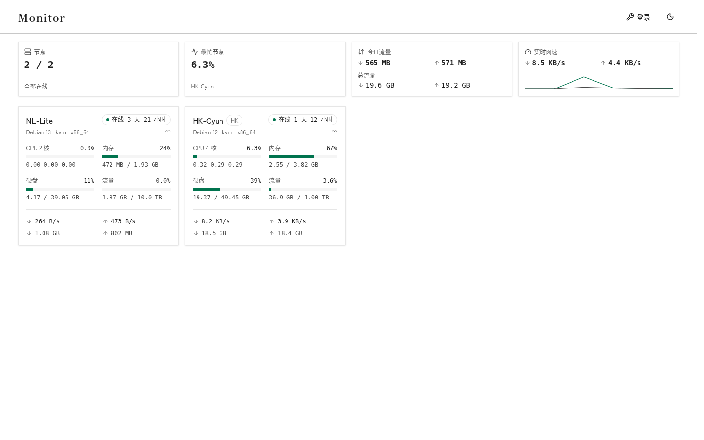

# monitor-theme-lone

A status-page theme for [monitor](https://github.com/monitor-probe/monitor). White page, dusk ink, one copper mark. The layout follows [monitor-theme-default](https://github.com/monitor-probe/monitor-theme-default).



## Install

Download `theme.tar.gz` from [Releases](https://github.com/hipness/monitor-theme-lone/releases). In the hub admin, open Themes and upload it. Or extract it yourself:

```bash
tar xzf theme.tar.gz -C /path/to/themes/ume
```

The directory name must be `ume`, matching `short` in `theme.json`. Switch to it on the Themes page. No restart.

A release is cut from a `v*` tag. The archive contains `theme.json`, `dist/`, and `preview.png`.

## Develop

Node 24. Point Vite at a local hub, then start the theme:

```bash
monitor-hub --listen 127.0.0.1:9911 --db /tmp/monitor.db --site http://127.0.0.1:9911
npm ci
npm run dev
```

`npm run dev` proxies `/api` and the WebSocket to that hub. Before a change lands, run:

```bash
npm run lint && npm test && npm run build
```

## What it draws

The theme is a static page. It reads four same-origin endpoints and nothing else:

| Endpoint | Use |
|---|---|
| `GET /api/me` | Site name, sign-in state, public-page switch |
| `GET /api/nodes` | Nodes, live metrics, traffic totals |
| `GET /api/nodes/{id}/metrics` | History and latency |
| `GET /api/ws` | A node snapshot every 2 seconds |

The node page is `/node/{id}`. Anonymous `/api/nodes` returns public nodes only, without `ip`, `hostname`, or `remark`.

Use the `loss` field on the metrics response for packet loss. Do not average the per-bucket `loss` values in the sample rows. Field names follow the hub's `src/api.rs`.

## License

MIT. The dashboard structure and charts are from monitor-theme-default, also MIT.
